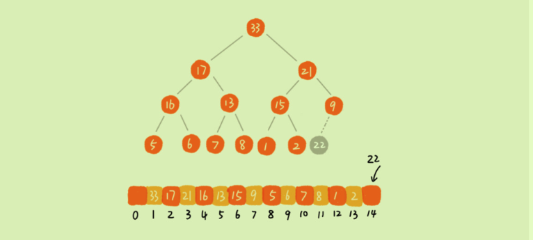
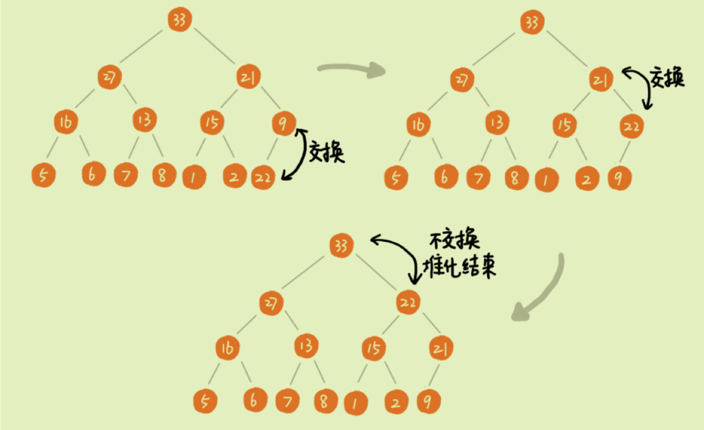
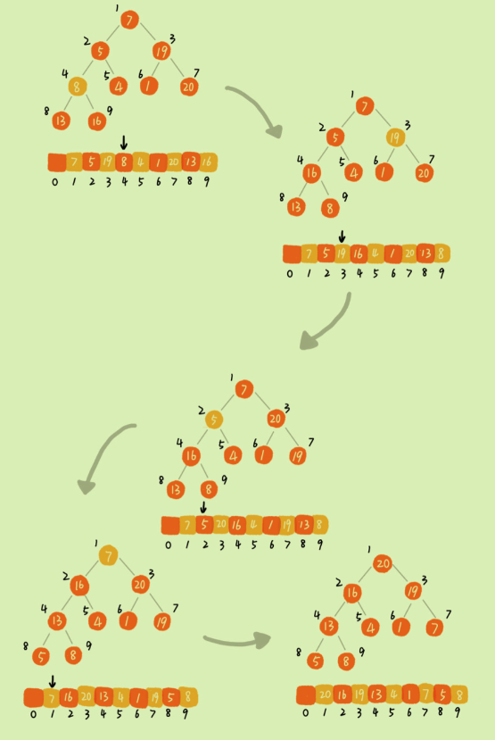
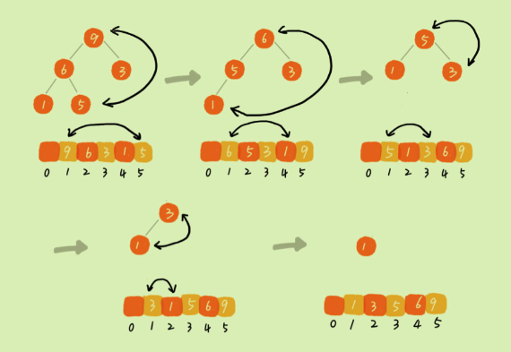

# Heap(max and min heap)
A head is a binary tree satisfy the following condition:
* The heap is a **complete binary tree**
* The value of each node in the heap must be greater than or equal to (or less than or equal to) the value of each node in the child tree.


## Representation of Heap
**Complete binary trees** are best stored in **arrays**. Using arrays to store complete binary trees is very storage efficient, because we don't need to store Pointers to the left and right children, we can find the left and right children and parents of a node simply by using the index of the array.


## Max Implementation
A Heap should contain the following API
* initialization with a comparator
* insert an element from the heap
* delete an element for the top(the greatest or the smallest)

Let's take the **max heap** as an example:

## Initialization

initialize a heap constructor with a comparator for internal comparison
> **b** refers to the value positioned at **i**, while **a**(the parent of b) at **i/2**, if a > b, that means the parent is greater the child
```js
// minHeap
const minHeapComparator = (a, b) => a > b
// maxHeap
const maxHeapComparator = (a, b) => a < b

const heap = new Heap(maxHeapComparator)
```
### Insert

Suppose we need to insert a new value named `22` to the existing heap


Here is a diagram of heapify. We can compare the value of the newly inserted node to the parent node. If the child node is not equal to or less than the parent, we swap two nodes. The process is repeated until the size relationship between the parent and child nodes is satisfied


The corresponding code: 
```js
export class Heap {
  constructor(comparator) {
    this._heap = [null]
    this._comparator = comparator
  }
  insert(element) {
    this._heap.push(element)
    this._swim(this._heap.length - 1)
  }
  _swim(k) {
    while (k > 1 && this._compare(Math.floor(k / 2), k)) {
      let i = Math.floor(k / 2)
      this._swap(i, k)
      k = i
    }
  }
  _compare(a, b) {
    return this._comparator(this._heap[a], this._heap[b])
  }
  _swap(a, b) {
    let temp = this._heap[a]
    this._heap[a] = this._heap[b]
    this._heap[b] = temp
  }
}
```
### poll
delete the `max` or `min` value in the heap


The corresponding code:
```js
export class Heap {
  constructor(comparator) {
    this._heap = [null]
    this._comparator = comparator
  }
  // --------same code as above -------
  poll() {
    let top = this._heap[1]
    // to avoid holes in the array, so we move swap the the first(greateset) element and last
    this._swap(1, this._heap.length - 1)
    // remove the last
    this._heap.pop()
    // heapify
    this._sink(1)
    return top
  }
  _sink(k) {
    while (2 * k < this._heap.length - 1) {
      let j = 2 * k
      if (j < this._heap.length && this._compare(j, j + 1)) {
        j++
      }
      // can not move down any more
      if (!this._compare(k, j)) break
      this._swap(k, j)
      k = j
    }
  }
}
```

The whole code can be found [Here](../src/data-structure/Heap.js)


## Heap sort
We can roughly break down the heap sorting process into two large steps, **heap building** and **sorting**

### Heap building
The leaf nodes will only be compared to themselves during the **heapify** process, so we can take the **non-leaf node** and heapify them one by one, **For a complete binary tree, all nodes with an index between [n/2+1, n] are leaves**



### Sorting
After the heap is built, the data in the array is organized according to the characteristics of the **max heap**. The first element in the array is the top of the heap, which is the largest element. We swap it with the last element, and that puts the largest element to index `n`.


## Usage

### React scheduler


## References
[Heap Wikipedia](https://en.wikipedia.org/wiki/Heap_(data_structure)#:~:text=The%20heap%20is%20one%20maximally,always%20stored%20at%20the%20root.)